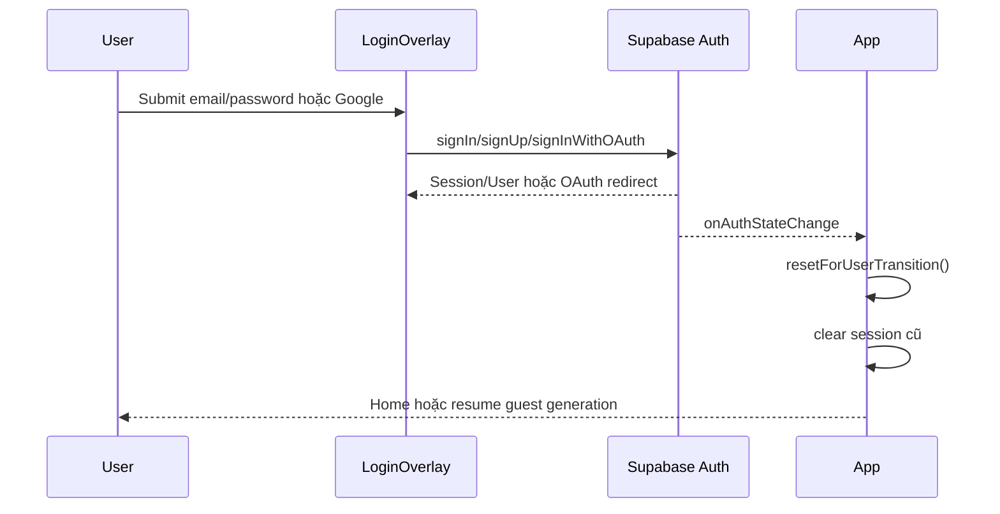
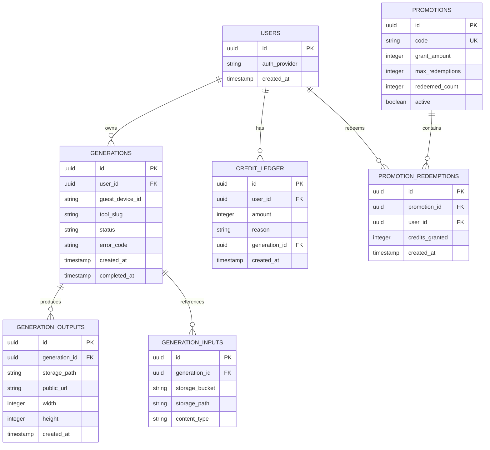

# Slora – Source Code Architecture

> Tài liệu này mô tả source code hiện tại trong repository `slora`.
>
> **Phạm vi:** frontend React/Vite/TypeScript và cách frontend kết nối tới Supabase + Sivitai API. Repository hiện tại không chứa source backend của Sivitai API; backend production được gọi qua `https://sivitai-api.onrender.com` bằng Vercel rewrite.

## 1. Tổng quan hệ thống

Slora là ứng dụng web tạo và chỉnh sửa hình ảnh bằng AI. Frontend chịu trách nhiệm:

- Hiển thị landing page, công cụ Try-on, Magic Editor và AI Studio.
- Đăng nhập/đăng ký bằng Supabase Auth.
- Upload ảnh nguồn.
- Lấy định nghĩa tool và schema input từ API.
- Tạo generation job và theo dõi trạng thái job.
- Hiển thị, tải xuống và mở lại ảnh trong My Library.
- Hiển thị paywall và quản lý trạng thái gói/credit ở phía client hiện tại.
- Thu thập thông tin người dùng cho Join Beta ở UI hiện tại.

Các hệ thống bên ngoài:

- **Supabase Auth:** user session, anonymous session và OAuth/password auth.
- **Sivitai API:** tool definition, image upload, generation job, generation result, gallery và promotion redemption.
- **AI generation provider:** được backend Sivitai API gọi, không nằm trong repository này.
- **Vercel:** hosting frontend và rewrite `/sivitai-api/*` tới backend production.

## 2. Cấu trúc source

```text
slora_production/
├── public/                         # Hình ảnh, video, SVG và static assets
├── src/
│   ├── main.tsx                    # React entry point
│   ├── App.tsx                     # App shell, routing và auth state
│   ├── App.css                     # Component/page styles
│   ├── index.css                   # Global styles, tokens và responsive rules
│   ├── components/
│   │   ├── home/
│   │   │   ├── HomePage.tsx        # Landing page và account menu
│   │   │   ├── ImageRevealBackground.tsx
│   │   │   └── PromoCodeRedeemer.tsx
│   │   └── ui/Corner.tsx            # UI decoration dùng lại
│   ├── features/
│   │   ├── auth/LoginOverlay.tsx
│   │   ├── core/CoreInteractiveGrid.tsx
│   │   ├── join-beta/JoinBetaPage.tsx
│   │   ├── library/LibraryPage.tsx
│   │   ├── paywall/PaywallPage.tsx
│   │   └── tryon/
│   │       ├── TryOnSection.tsx     # Try-on, Magic Editor, AI Studio
│   │       ├── magicEditorPrompts.ts
│   │       └── tryonSession.ts       # Session/pending guest generation
│   └── lib/
│       ├── supabase.ts               # Supabase client và provider check
│       ├── sivitai.ts                # API client và response validation
│       ├── freeGeneration.ts         # Device id, free/purchased credits client state
│       └── imageLibrary.ts           # Local library cache/hide state
├── docs/
│   ├── SOURCE_CODE_ARCHITECTURE.md   # Tài liệu này
│   ├── PROMOTION_API_CONTRACT.md
│   ├── QA_ROLE_FLOW_REPORT.md
│   └── QA_ROLE_TEST_CASES.md
├── vercel.json                       # Rewrite API production
├── vite.config.ts
└── package.json
```

## 3. Application flow

### 3.1 Khởi động app và routing

`src/main.tsx` mount React app. `src/App.tsx` quản lý routing đơn giản bằng `window.history` thay vì React Router.

| URL | Component | Mục đích |
|---|---|---|
| `/` | `HomePage` | Landing page, core functions và generation workspace |
| `/join-beta` | `JoinBetaPage` | Form khảo sát người dùng beta |
| `/library` | `LibraryPage` | Danh sách ảnh đã tạo của user |
| `/paywall` | `PaywallPage` | Chọn plan và hiển thị purchase flow |

Query parameters được dùng để mở lại context:

- `/?tool=try-on&image=<url>`: mở Try-on với tool/ảnh đã chọn.
- `/?return=tryon-result`: quay lại vùng Try-on sau paywall.
- `/paywall?plan=<plan>&return=tryon-result`: mở đúng plan và giữ return context.
- `/?resume=guest-generation`: resume generation sau khi guest đăng nhập.

```mermaid
flowchart TD
    A[Browser mở /] --> B[main.tsx mount App]
    B --> C[Supabase getUser]
    C --> D[Đăng ký onAuthStateChange]
    D --> E{pathname}
    E -->|/| F[HomePage]
    E -->|/join-beta| G[JoinBetaPage]
    E -->|/library| H[LibraryPage]
    E -->|/paywall| I[PaywallPage]
    F --> J[History pushState / popstate]
    J --> E
```



### 3.2 Authentication flow

1. `App` gọi `supabase.auth.getUser()` khi khởi động.
2. `supabase.auth.onAuthStateChange()` cập nhật user khi login, logout hoặc OAuth callback.
3. `LoginOverlay` hỗ trợ:
   - Google OAuth.
   - Email/password sign in.
   - Email/password sign up.
   - Recovery flow thông qua hash URL.
4. Khi user chuyển đổi, `App` xóa Try-on session cũ để tránh rò rỉ state giữa các user.
5. Nếu có guest generation đang chờ và user vừa đăng nhập, app điều hướng về home với `resume=guest-generation`.



### 3.3 Guest generation và user generation

Frontend cho phép anonymous user bắt đầu generation nếu Supabase hỗ trợ anonymous sign-in.

`src/lib/sivitai.ts`:

- `getAccessToken('optional')` lấy session hiện tại.
- Nếu chưa có session, gọi `supabase.auth.signInAnonymously()`.
- Promise anonymous sign-in được share để tránh React Strict Mode tạo nhiều guest session song song.
- Request có timeout 30 giây.

`src/features/tryon/TryOnSection.tsx` quản lý:

- Tool hiện tại: `try-on`, `magic-editor`, `kol-ai`.
- Upload person/clothing/source image.
- Input theo `ToolDefinition.inputSchema`.
- Kiểm tra free/purchased generation balance.
- Tạo job.
- Poll trạng thái job mỗi 2.5 giây.
- Hiển thị output và lưu ảnh vào local library.

```mermaid
flowchart TD
    A[Chọn tool] --> B[getTool(slug)]
    B --> C[Render inputSchema]
    C --> D[Chọn sample hoặc upload file]
    D --> E[uploadSourceImage]
    E --> F[Nhận storageBucket/storagePath reference]
    F --> G{Có đủ credit?}
    G -->|Không| H[Mở Paywall hoặc yêu cầu đăng nhập]
    G -->|Có| I[Build inputs]
    I --> J[createGeneration]
    J --> K[Nhận generationId]
    K --> L[Poll getGeneration mỗi 2.5s]
    L --> M{status}
    M -->|queued/processing| L
    M -->|failed/cancelled| N[Hiển thị lỗi]
    M -->|completed| O[Validate HTTPS output URL]
    O --> P[Hiển thị kết quả]
    P --> Q[addLibraryImages / Download / Edit tiếp]
```

### 3.4 Resume guest generation sau login

Khi guest đã upload ảnh hoặc đang chuẩn bị generation, `tryonSession.ts` lưu pending data vào `sessionStorage`. Khi user đăng nhập:

1. `App.resetForUserTransition()` phát hiện pending guest generation.
2. App điều hướng về `/?resume=guest-generation`.
3. `HomePage` scroll tới Try-on.
4. `TryOnSection` đọc pending session, lấy lại tool definition và tiếp tục flow.
5. Pending session được clear sau khi resume thành công hoặc khi session không còn cần thiết.

Không lưu access token trong `localStorage`; token do Supabase quản lý.

### 3.5 Generation status và output validation

API client định nghĩa các trạng thái:

```text
queued → processing → completed
                    ↘ failed
                    ↘ cancelled
```

Output URL chỉ được chấp nhận nếu:

- URL parse thành công.
- Protocol là `https:`.
- Trong development, `http:` chỉ được phép với `localhost` hoặc `127.0.0.1`.

Điều này được thực hiện bởi `isSafeRemoteUrl()` trước khi render hoặc download ảnh.

### 3.6 Library flow

1. User mở `/library`.
2. User phải là authenticated non-anonymous user.
3. `LibraryPage` gọi `getMyLibrary()`.
4. API hiện tại dùng endpoint `/generations/gallery?limit=20` và cursor pagination.
5. Frontend lọc URL không an toàn và ảnh đã hide trên thiết bị.
6. User có thể:
   - Preview full image.
   - Try on ảnh.
   - Mở Magic Editor.
   - Download nếu API trả `downloadUrl`.
   - Remove khỏi thiết bị hiện tại.

Lưu ý: thao tác Remove hiện chỉ ẩn ảnh ở client/device thông qua `localStorage`, không xóa output trên server.

### 3.7 Credit, promo và paywall flow hiện tại

`freeGeneration.ts` hiện giữ các giá trị sau trong `localStorage`:

- `slora-device-id`
- `slora-free-generation-used`
- `slora-purchased-generations`
- `slora-current-package`

Quy tắc hiện tại:

- Một free generation mặc định cho mỗi device.
- Purchased generations được cộng/trừ ở client.
- Khi tạo generation, frontend đánh dấu đã dùng credit sau khi flow phù hợp.
- Paywall hiện đang là **test purchase flow**: xác nhận plan sẽ gọi `addPurchasedGenerations()` và chưa tích hợp payment gateway thật.
- Promo code gọi backend `/api/promotions/redeem` và yêu cầu authenticated user.

> **Production warning:** credit authorization không nên dựa vào browser storage. Backend cần giữ credit ledger và atomically reserve/decrement credit. Chi tiết contract nằm trong `docs/PROMOTION_API_CONTRACT.md`.

## 4. Frontend–backend API structure

### 4.1 API base URL và proxy

```text
Development/default:
  VITE_API_BASE_URL hoặc /sivitai-api

Production Vercel:
  /sivitai-api/:path*  →  https://sivitai-api.onrender.com/:path*
```

Cấu hình nằm trong `vercel.json`. Frontend không gọi trực tiếp provider AI; mọi generation request đi qua Sivitai API.

### 4.2 API client layers

`src/lib/sivitai.ts` là boundary duy nhất cho các API chính:

| Function | HTTP | Endpoint | Auth |
|---|---|---|---|
| `getTool(slug)` | GET | `/api/tools/:slug` | none |
| `uploadSourceImage()` | POST | `/generations/source-images` | optional |
| `createGeneration()` | POST | `/api/tools/:slug/jobs` | optional |
| `getGeneration()` | GET | `/generations/:generationId` | optional |
| `getMyLibrary()` | GET | `/generations/gallery` | required |
| `redeemPromoCode()` | POST | `/api/promotions/redeem` | required |

Request wrapper đảm nhiệm:

- Validate path bắt đầu bằng `/`.
- Set `Content-Type: application/json` khi có body.
- Gắn `Authorization: Bearer <access_token>` khi cần.
- Abort request sau 30 giây.
- Parse error message từ JSON response.
- Chuẩn hóa URL output an toàn.

```mermaid
flowchart LR
    UI[React feature components] --> API[src/lib/sivitai.ts]
    API --> AUTH[src/lib/supabase.ts]
    API --> REWRITE[/sivitai-api rewrite]
    REWRITE --> BACKEND[Sivitai API on Render]
    BACKEND --> DB[(Backend database/ledger)]
    BACKEND --> AI[AI generation provider]
    AUTH --> SUPA[Supabase Auth]
```

## 5. Backend structure – boundary và contract

### 5.1 Những gì có trong repository

Repository này **không có backend implementation đầy đủ**. Không có thư mục server/API chứa handler cho các endpoint generation. Backend production hiện được tham chiếu bởi:

```json
{
  "rewrites": [
    {
      "source": "/sivitai-api/:path*",
      "destination": "https://sivitai-api.onrender.com/:path*"
    }
  ]
}
```

Vì vậy, phần dưới đây là cấu trúc backend được frontend yêu cầu/giả định, không phải danh sách file đã tồn tại trong repository.

### 5.2 Backend modules nên có

```text
sivitai-api/
├── src/
│   ├── server.ts                 # HTTP server/bootstrap
│   ├── routes/
│   │   ├── tools.ts              # GET tool definition
│   │   ├── generations.ts        # upload, create job, status, gallery
│   │   └── promotions.ts         # redeem promo code
│   ├── middleware/
│   │   ├── auth.ts               # Verify Supabase JWT
│   │   ├── validation.ts         # Validate body/path/schema
│   │   ├── rateLimit.ts
│   │   └── errorHandler.ts
│   ├── services/
│   │   ├── toolService.ts
│   │   ├── generationService.ts  # Queue/orchestrate AI job
│   │   ├── storageService.ts     # Source/output image storage
│   │   ├── creditService.ts      # Ledger and atomic reservation
│   │   ├── promotionService.ts
│   │   └── galleryService.ts
│   ├── workers/
│   │   └── generationWorker.ts   # Process queued jobs
│   ├── db/
│   │   ├── migrations/
│   │   └── queries/
│   └── schemas/
│       ├── tool.ts
│       ├── generation.ts
│       └── promotion.ts
└── tests/
    ├── auth/
    ├── generations/
    └── promotions/
```

### 5.3 Backend endpoint responsibilities

#### `GET /api/tools/:slug`

- Validate slug.
- Trả tool name và `inputSchema.fields`.
- Không trả secret provider configuration.
- Schema phải mô tả field type, role, required, default và options.

Ví dụ response tối thiểu:

```json
{
  "slug": "try-on",
  "name": "Try-on",
  "inputSchema": {
    "fields": [
      { "name": "personImage", "role": "source", "type": "image", "required": true },
      { "name": "clothingImage", "role": "reference", "type": "image", "required": true }
    ]
  }
}
```

#### `POST /generations/source-images`

- Xác thực optional cho guest flow.
- Validate data URL, MIME type, kích thước và giới hạn file.
- Decode và lưu source image vào private/object storage.
- Trả reference, không trả secret storage credential:

```json
{
  "storageBucket": "source-images",
  "storagePath": "user-or-guest/job/source.png",
  "contentType": "image/png",
  "originalName": "person.png",
  "imageUrl": "https://..."
}
```

#### `POST /api/tools/:slug/jobs`

- Verify JWT nếu user flow; guest token/device policy nếu anonymous flow.
- Validate `inputs` theo tool schema ở server, không tin schema/client.
- Validate `X-Device-ID` format và rate limit.
- Kiểm tra entitlement/credit ở server.
- Reserve một credit trong transaction.
- Tạo generation record với status `queued`.
- Đẩy job vào queue.
- Trả `generationId` và status ban đầu.

```json
{
  "generationId": "uuid",
  "status": "queued"
}
```

#### `GET /generations/:generationId`

- Chỉ cho phép owner hoặc guest token tương ứng đọc job.
- Trả status, outputs và error message an toàn.
- Không trả provider credentials hoặc internal stack trace.
- Khi job completed, outputs phải có URL HTTPS có thời hạn phù hợp.

#### `GET /generations/gallery`

- Bắt buộc authenticated non-anonymous user.
- Trả output thuộc user hiện tại.
- Hỗ trợ `limit` và `cursor`.
- Không cho client truy cập ảnh của user khác.

#### `POST /api/promotions/redeem`

Theo `docs/PROMOTION_API_CONTRACT.md`:

- Verify Supabase JWT và lấy `user_id` từ token.
- Normalize code bằng trim + uppercase.
- Lock promotion row hoặc dùng serializable/atomic transaction.
- Enforce một redemption/user bằng unique constraint.
- Enforce global max redemption.
- Ghi credit ledger và cập nhật balance trong cùng transaction.
- Trả balance từ server, không lấy từ client.

## 6. Data model backend đề xuất



## 7. Security và reliability checklist

### Frontend

- Không commit secret key vào source hoặc `.env` tracked.
- Chỉ dùng Supabase anon key ở frontend.
- Không render remote image URL nếu chưa qua `isSafeRemoteUrl()`.
- Không tin credit balance từ URL hoặc input người dùng.
- Giới hạn timeout API và hiển thị lỗi rõ ràng.
- Không giữ access token trong custom localStorage key.

### Backend

- Verify Supabase JWT server-side cho mọi endpoint protected.
- Enforce ownership của generation/gallery.
- Validate tool inputs server-side.
- Rate-limit upload, job creation, status polling và promo redemption.
- Reserve/decrement credit atomically.
- Idempotency key cho create job và promo redemption.
- Không trả stack trace, provider token hoặc storage secret.
- Dùng signed URL/private bucket cho source image nếu dữ liệu nhạy cảm.
- Có cleanup policy cho source image và failed job.
- Có audit log cho credit, promotion và generation.

## 8. Local development

```bash
npm install
npm run dev -- --host 0.0.0.0
```

Các lệnh kiểm tra:

```bash
npm run build
npm run lint
```

Frontend cần các biến môi trường tương ứng trong `.env.local` hoặc `.env.production`:

```text
VITE_SUPABASE_URL
VITE_SUPABASE_ANON_KEY
VITE_API_BASE_URL                 # optional; mặc định /sivitai-api
VITE_FREE_GENERATION_LOCK_ENABLED # optional; chỉ phục vụ test client hiện tại
```

Không ghi giá trị secret thật vào tài liệu hoặc commit vào repository.

## 9. Known gaps / việc cần hoàn thiện

1. **Payment thật chưa được tích hợp:** `PaywallPage` hiện ghi purchased generations vào localStorage dưới nhãn test purchase.
2. **Credit authority đang ở client:** cần chuyển entitlement và reservation sang backend ledger.
3. **Join Beta chưa có submit API:** `JoinBetaPage` hiện mới lưu state trong form và `preventDefault()` khi submit.
4. **Library remove chỉ local/device-level:** chưa có delete/archive endpoint server.
5. **Backend source không nằm trong repository:** cần tài liệu/API contract riêng cho Sivitai API và generation worker.
6. **Cần test E2E:** login, guest resume, upload, polling, failure, paywall, gallery ownership và promo race condition.

## 10. Verification snapshot

Tại thời điểm viết tài liệu:

- `npm run build`: pass.
- `npm run lint`: pass.
- Frontend source sử dụng TypeScript/React và Vite.
- Production API rewrite được cấu hình trong `vercel.json`.
